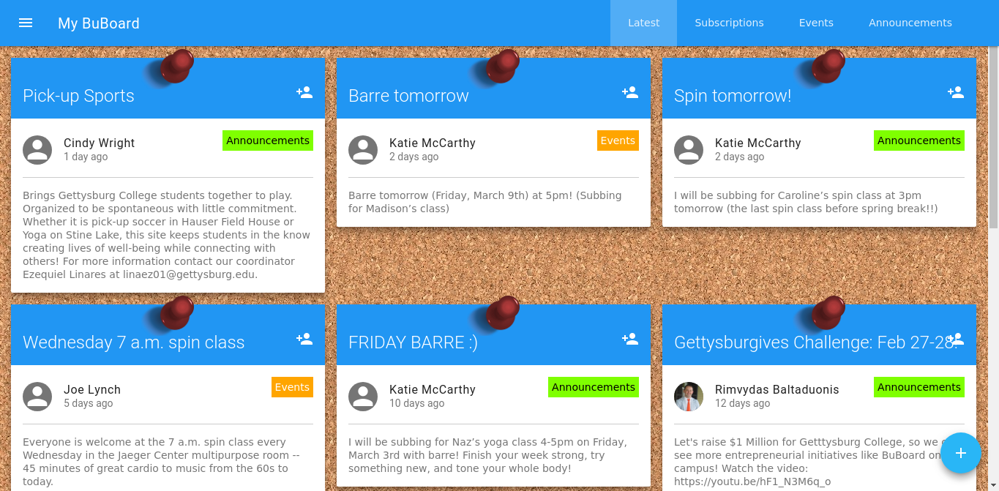

# BuBoard
A skeumorphic bulletin board application for announcing and following local events and announcements. Account subscriptions, sorting, and attachments all supported. A hyper-local twitter clone.



A senior project by CS students at Gettysburg College.

Copyleft Michael Clark-Cuadrado, Jingyi 'Jannie' Liu, and Zachary Miller.

## Using / Hacking

### Configuration
The file `docker-compose.yml` takes configuration of things like the current public url, the smtp server, the twilio API keys, etc. It is mandatory to fill in these values before deploying the application for proper functionality of all features.  

### Default Passwords
Database / phpmyadmin passwords: root:buboard

Buboard default administrator account: buboardadmin:buboardadmin

### Database Browsing
A PhpMyAdmin server is available locally on port 8080. Recommended to disabled in docker-compose.yml before deployment.

### Starting in Docker
#### First Run:
Clone the repo, then run `docker-compose up`

#### To reset the database to a blank slate from the schema:
```
docker-compose down
docker volume rm buboard_buboard-db
docker-compose up --build
```
## Agile Scrum Lean Kanban Trello Buzzword Sprint Tracking
https://trello.com/b/gqkhN5NT/buboard-dev
